# 🚀 Mastering Version Control: SVN & Mercurial

## 📚 Introduction to Version Control Systems

Version Control Systems (**VCS**) are indispensable tools for managing software development, tracking changes, and facilitating team collaboration.

### 🌐 Types of Version Control Systems
1. **Centralized Version Control Systems (CVCS)** – All versions and files are stored on a single central server (e.g., **Subversion (SVN)**).
2. **Distributed Version Control Systems (DVCS)** – Every user has a complete local copy of the repository (e.g., **Mercurial (HG)**).

### 🎯 Why Version Control Matters
- 🔍 **Track Changes:** Maintain a full history of modifications.
- 🤝 **Collaborate Seamlessly:** Multiple developers can work on the same codebase.
- 🔄 **Rollback & Recovery:** Restore previous versions with ease.
- 🌿 **Branch & Merge:** Test new features without affecting the main code.

---

## 🛠 Subversion (SVN)

### 🌀 What is SVN?
SVN (**Apache Subversion**) is a **centralized version control system (CVCS)** designed to help developers manage changes to files over time.

### 🚀 Key Features of SVN
- **Central Repository:** All files and version history live on a central server.
- **Revision-Based Tracking:** Each commit generates a new revision number.
- **Atomic Commits:** Changes are either fully committed or not at all.
- **Branching & Tagging:** Organized using directory structures.
- **Access Control:** Manage file-level permissions.
- **Locking Mechanism:** Prevent simultaneous file edits.

---

## 🔍 How SVN Works

1️⃣ **Central Repository:** The server stores the complete project history.

2️⃣ **Working Copy:** Developers get a local copy to modify.

3️⃣ **Changes & Commits:**
   - Edit files locally.
   - Commit changes to the repository.
   - SVN assigns a new revision number.

4️⃣ **Updates & Merging:**
   - Update the working copy with the latest changes.
   - SVN merges modifications from multiple developers.

---

## 🔧 Basic SVN Commands

| **Command** | **Description** |
|-------------|----------------|
| `svn checkout <repo-url>` | Get a working copy of the repository. |
| `svn update` | Update local copy with the latest changes. |
| `svn add <file>` | Add a new file to version control. |
| `svn commit -m "Message"` | Commit changes to the repository. |
| `svn revert <file>` | Undo local changes before committing. |
| `svn status` | Show modified files. |
| `svn log` | View commit history. |
| `svn diff` | Compare changes between revisions. |
| `svn resolve` | Resolve merge conflicts. |

---

## 🔄 SVN Workflow

⬇️ Checkout → 📝 Edit → ✔️ Commit → 🔃 Update → ⚔️ Resolve Conflicts

---

## 💡 Setting Up SVN on Windows

1. 💾 **Install SVN** ([TortoiseSVN](https://tortoisesvn.net/)).
2. 🔄 Restart your computer.
3. ✅ Verify installation:

```sh
svn --version
```


---

## ⚙️ Essential SVN Commands with Screenshots

✅ **Step 1: Creating a Repository**

```sh
svnadmin create C:\svn_repos\my_repo
```

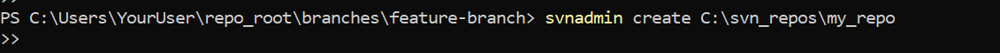

✅ **Step 2: Checking Out a Repository**

```sh
svn checkout file:///C:/svn_repos/my_repo C:\Users\YourUser\my_working_copy
```

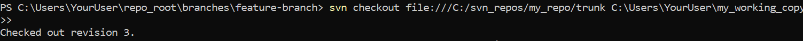

✅ **Step 3: Making Changes & Committing**

```sh
svn add file.txt
svn commit -m "Added file.txt"

```
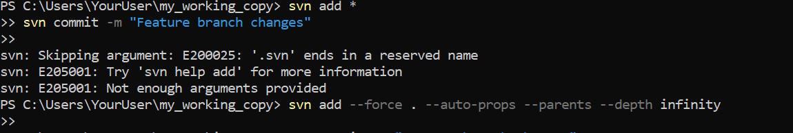

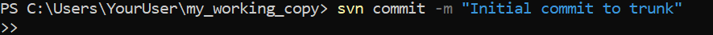

✅ **Step 4: Updating & Viewing Logs**

```sh
svn update  
svn log
```


✅ **Step 5: Reverting Changes**

```sh
svn revert file.txt
```


✅ **Step 6: Branching & Merging**

```sh
svn copy file:///C:/svn_repos/my_repo/trunk file:///C:/svn_repos/my_repo/branches/feature-branch -m "Creating a feature branch"
svn merge file:///C:/svn_repos/my_repo/branches/feature-branch
```

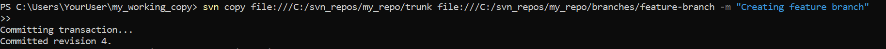
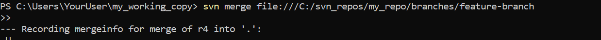

---

## 🌐 Mercurial (HG) - A Distributed Version Control System

### 🔄 Mercurial Workflow

🔽 Clone → 📝 Edit → ✔️ Commit → ⬆️ Push → ⬇️ Pull & Merge

---

## 💡 Setting Up Mercurial on Windows

1. 💾 **Install Mercurial** ([TortoiseHg](https://tortoisehg.bitbucket.io/)).
2. 🔄 Restart your computer.
3. ✅ Verify installation:

```sh
hg --version
```

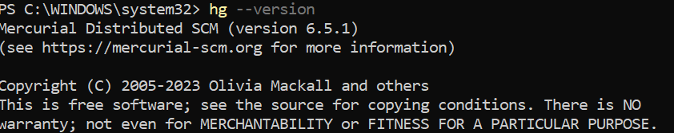

---

## ⚙️ Essential Mercurial Commands with Screenshots

✅ **Step 1: Creating a Repository**

```sh
hg init my-hg-repo
```


✅ **Step 2: Adding & Committing Files**

```sh
hg add newfile.txt  
hg commit -m "Added newfile.txt"
```

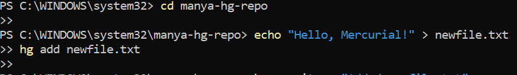

✅ **Step 3: Cloning, Updating & Reverting**

```sh
hg clone https://example.com/repo  
hg pull  
hg update  
hg log
```

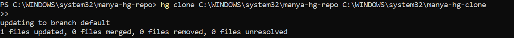
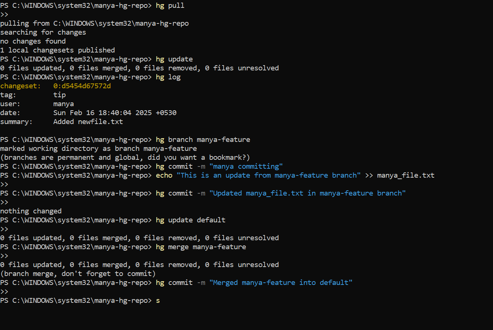

✅ **Step 4: Branching & Merging**

```sh
hg branch new-feature  
hg merge
```

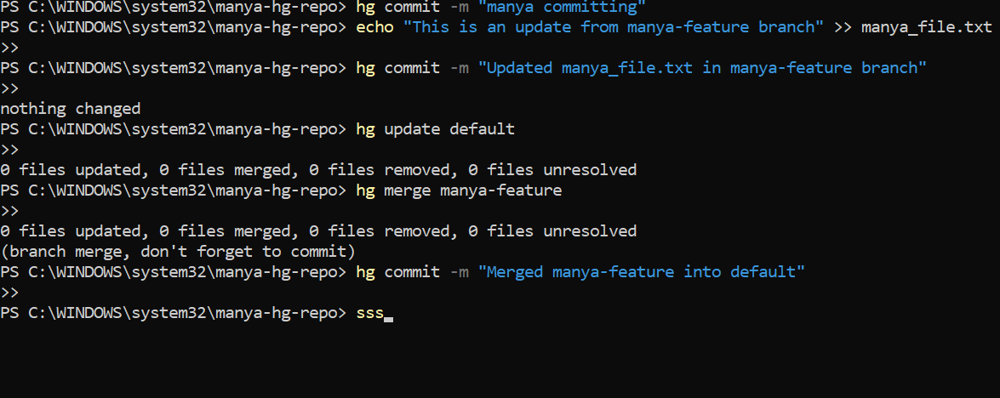


---

## 🏆 SVN vs. Mercurial: A Quick Comparison

| Feature       | Subversion (SVN) | Mercurial (HG) |
|---------------|------------------|----------------|
| Type          | Centralized VCS  | Distributed VCS|
| Offline Work  | ❌ Limited        | ✅ Fully Offline|
| Branching     | ⚠️ Complicated    | ✅ Simple & Fast|
| Performance   | 🐢 Slower         | 🚀 Faster      |
| Learning Curve| 👍 Easier for Teams| 👍 Easier for Individuals |

---

## 🔧 Best Practices & Troubleshooting

- ✅ Use **SVN** for centralized team collaboration.
- ✅ Use **Mercurial** for offline flexibility.
- ✅ Write meaningful **commit messages**.
- ✅ Regularly **backup repositories**.
- ✅ Resolve **merge conflicts carefully**.

---

✨ *By: MANYA MANGLA* 🚀

---

